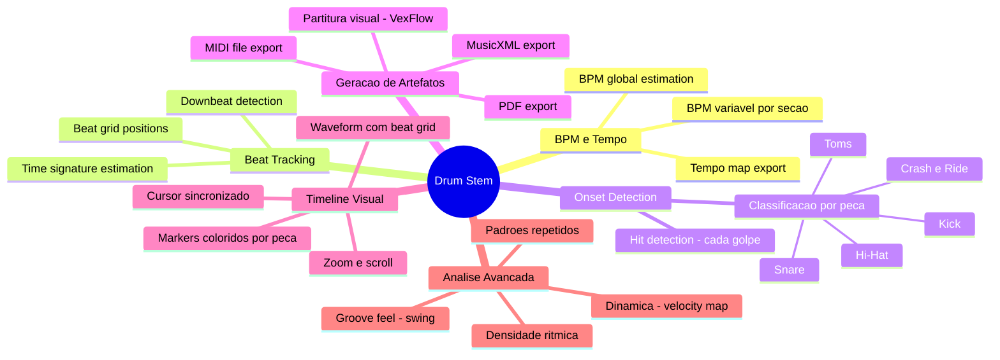

# 🥁 Drum Analysis — Análise Técnica e Proposta de Implementação

> **Escopo**: Evolução do `music-analyzer` para funcionalidades avançadas de análise do stem de bateria.
> **Data**: 28/04/2026 — **Status**: Proposta (sem implementação)

---

## 1. O que já temos hoje

O MVP do `music-analyzer` já entrega uma base sólida que simplifica muito o trabalho de análise de bateria:

| Capacidade | Detalhes |
|---|---|
| **Separação de stems** | Pipeline Demucs (htdemucs) gera stem isolado de **drums** em MP3 320kbps |
| **Player profissional** | Web Audio API com gain, pan, solo/mute por stem, osciloscópio em tempo real |
| **Mixer com presets** | Layouts como "Drum Focus" já priorizam o stem de bateria |
| **Métricas master** | LUFS, True Peak e Headroom via ffmpeg/loudnorm |
| **Arquitetura** | Backend FastAPI + use cases desacoplados; Frontend React com hooks isolados |
| **Dependências no projeto** | `librosa>=0.10.2` já está no `requirements.pipeline.txt`; `basic-pitch` e `pretty-midi` estão listados mas desabilitados (incompatibilidade Python 3.13) |

> [!IMPORTANT]
> O stem de **drums** isolado pelo Demucs é o ativo mais valioso. Ele elimina a necessidade de HPSS (Harmonic-Percussive Source Separation) que seria necessária se trabalhássemos com o áudio completo. Todas as análises partem diretamente desse stem limpo.

---

## 2. Ferramentas de mercado — Benchmark

### 2.1 Ferramentas comerciais

| Ferramenta | O que faz | Modelo de negócio | Limitações |
|---|---|---|---|
| **Moises AI** | Separação de stems + prática (tempo/pitch) + detecção de acordes | SaaS (freemium ~$40/mês) | **Não gera** partitura de bateria nem MIDI. Foco em prática, não transcrição |
| **Klangio — Drum2Notes** | Upload de áudio/YouTube → partitura de bateria (PDF) + MIDI (MusicXML) | SaaS (~€3/transcrição) | Transcrição automática raramente 100% precisa em fills complexos |
| **Playdrumsonline** | IA para isolar stems e gerar partitura básica de bateria | SaaS gratuito/limitado | Qualidade inferior em transcrições complexas |
| **Drumstik** | Notação a partir de e-drums (MIDI input) | App desktop | Requer bateria eletrônica; não funciona com áudio |
| **Aered** | Editor de partituras de bateria (manual) | Desktop gratuito | Não faz transcrição automática; apenas edição |
| **DrumTracker (Toontrack)** | Audio-to-MIDI para bateria | **Descontinuado** (2013) | Não compatível com 64-bit moderno |

> [!NOTE]
> **Posicionamento**: Nenhuma ferramenta do mercado combina stem separation + análise de BPM + transcrição + timeline sincronizada em uma única interface integrada. É exatamente nesse gap que podemos nos posicionar.

### 2.2 O que o mercado faz bem que devemos mirar

1. **BPM detection** — Moises mostra BPM em tempo real; é esperado pelo usuário
2. **Beat grid visual** — Pro Tools, Ableton e Moises mostram grid de beats na waveform
3. **Partitura gerada** — Drum2Notes (Klangio) é a referência em transcrição automática
4. **Export MIDI** — Padrão na indústria para reaproveitamento em DAWs
5. **Timeline com markers** — Toda DAW profissional tem marcadores de compasso/beat

---

## 3. Bibliotecas disponíveis — Stack técnico

### 3.1 Backend (Python)

| Biblioteca | PyPI | O que faz | Compatibilidade | Já no projeto? |
|---|---|---|---|---|
| **librosa** | `librosa>=0.10.2` | BPM estimation (`beat_track`), onset detection (`onset_detect`), onset strength, HPSS, spectral features | Python 3.9–3.13 ✅ | ✅ Já em `requirements.pipeline.txt` |
| **madmom** | `madmom==0.16.1` | Beat tracking com RNN (superior ao librosa), downbeat detection, onset detection neural | ⚠️ Python ≤3.9; problemas com 3.10+ | ❌ Não instalado |
| **pretty_midi** | `pretty_midi>=0.2.10` | Manipulação programática de MIDI; drum map (GM mapping note 36=kick, 38=snare, 42=hihat...) | Python 3.9–3.13 ✅ | ⚠️ Listado mas desabilitado |
| **music21** | `music21>=9.1` | Parsing MIDI, exportação MusicXML, teoria musical completa | Python 3.10+ ✅ | ❌ Não instalado |
| **PyDrumScore** | `pydrumscore` | Gera arquivo `.mscx` (MuseScore) diretamente a partir de drum events em Python | Python 3.8+ ✅ | ❌ Não instalado |
| **mido** | `mido>=1.3` | Leitura/escrita de MIDI de baixo nível; mais leve que pretty_midi | Python 3.7+ ✅ | ❌ Não instalado |
| **numpy** | `numpy>=1.26` | Operações vetoriais para processamento de onset envelopes | ✅ | ✅ Já instalado |
| **soundfile** | `soundfile>=0.12.1` | Leitura de arquivos de áudio (WAV, FLAC) | ✅ | ✅ Já instalado |

#### Recomendação de stack backend

```
librosa          → BPM, beat tracking, onset detection (JÁ TEMOS)
pretty_midi      → Geração de MIDI com drum mapping (REATIVAR)
music21          → Conversão MIDI → MusicXML (ADICIONAR)
```

> [!WARNING]
> **madmom** oferece beat tracking superior via RNN, mas tem sérios problemas de compatibilidade com Python 3.10+. O projeto usa Python 3.13. Recomendo **não** adotar madmom e usar librosa como base, que já está no projeto e funciona perfeitamente.

### 3.2 Frontend (JavaScript)

| Biblioteca | npm | O que faz | Maturidade |
|---|---|---|---|
| **WaveSurfer.js 7** | `wavesurfer.js` | Waveform renderização + Regions Plugin (markers, regiões coloridas), timeline plugin, zoom | ⭐ Muito madura, 10k+ stars |
| **VexFlow** | `vexflow` | Renderização de partitura musical no browser (SVG/Canvas). Suporta clave de percussão, noteheads customizados (x, triangle, diamond) | ⭐ Referência em notação web |
| **OSMD** (OpenSheetMusicDisplay) | `opensheetmusicdisplay` | Renderização de MusicXML completo no browser. Suporte nativo a percussão (noteheads, 1-line ou 5-line staff) | ⭐ Excelente para MusicXML |
| **Tone.js** | `tone` | Scheduling de áudio preciso com Transport (sync de playback com timeline) | ⭐ Web Audio framework líder |
| **abcjs** | `abcjs` | Notação musical simples via ABC notation | Mais simples, menos controle |

#### Recomendação de stack frontend

```
WaveSurfer.js 7   → Waveform do stem de drums + beat markers visuais
VexFlow           → Renderização de partitura de bateria (percussão)
```

> [!TIP]
> **VexFlow vs OSMD**: VexFlow dá mais controle granular e é melhor para renderização incremental de partituras sincronizadas com playback. OSMD é melhor para exibir um MusicXML estático completo. Para nosso caso (partitura que acompanha o playback), VexFlow é a escolha certa.

---

## 4. O que podemos fazer com o stem de bateria

### Feature Map completo



---

## 5. Proposta de implementação — 4 Fases

### Fase 1 — BPM & Beat Tracking (Fundação)
> **Esforço estimado**: 3–5 dias  
> **Risco técnico**: Baixo

#### Backend
- Novo use case: `AnalyzeDrumStemUseCase`
- Usa `librosa.beat.beat_track(y, sr)` no stem de drums para obter:
  - **BPM estimado** (global)
  - **Beat positions** (array de timestamps em segundos)
- Novo modelo Pydantic: `DrumAnalysis` com campos `bpm`, `beats[]`, `time_signature`
- Persiste resultado em JSON no storage da sessão (`{session_id}/drum_analysis.json`)
- Novo endpoint: `GET /api/sessions/{id}/drum-analysis`

#### Frontend
- Exibir **BPM** no painel de métricas (ao lado de LUFS/Peak/Headroom)
- Exibir **beat count** e **time signature** estimada

#### Exemplo de código backend (conceitual)
```python
import librosa
import numpy as np

def analyze_drum_stem(stem_path: str) -> dict:
    y, sr = librosa.load(stem_path, sr=22050)
    
    # BPM e posição dos beats
    tempo, beat_frames = librosa.beat.beat_track(y=y, sr=sr)
    beat_times = librosa.frames_to_time(beat_frames, sr=sr).tolist()
    
    return {
        "bpm": round(float(tempo), 1),
        "beats": beat_times,
        "duration": float(librosa.get_duration(y=y, sr=sr)),
    }
```

---

### Fase 2 — Onset Detection & Classificação de Peças
> **Esforço estimado**: 5–8 dias  
> **Risco técnico**: Médio (classificação por peça é o desafio)

#### Backend
- Onset detection com `librosa.onset.onset_detect()` no stem de drums
- **Classificação por faixa de frequência** (abordagem por análise matemática do áudio, sem inteligência artificial):
  - **Kick** (20–150 Hz): energia predominante em sub-bass
  - **Snare** (150–1000 Hz): energia em mid + transiente brilhante
  - **Hi-Hat/Cymbals** (4000–16000 Hz): energia predominante em altas frequências
  - **Toms** (80–500 Hz): energia em mid-low
- Cada onset recebe um label (`kick`, `snare`, `hihat`, `tom`, `cymbal`)
- Resultado amplia o `DrumAnalysis` com campo `hits[]`:
  ```json
  {
    "time": 1.234,
    "type": "kick",
    "velocity": 0.85
  }
  ```

#### Abordagem de classificação (regras fixas por frequência)
```python
def classify_hit(y_segment, sr):
    """Classifica um hit de bateria por análise espectral."""
    S = np.abs(librosa.stft(y_segment))
    freqs = librosa.fft_frequencies(sr=sr)
    
    low = S[(freqs >= 20) & (freqs <= 150)].sum()
    mid = S[(freqs >= 150) & (freqs <= 1000)].sum()
    high = S[(freqs >= 4000) & (freqs <= 16000)].sum()
    
    total = low + mid + high + 1e-8
    
    if low / total > 0.5:
        return "kick"
    elif high / total > 0.4:
        return "hihat"
    elif mid / total > 0.4:
        return "snare"
    else:
        return "tom"
```

> [!NOTE]
> **Alternativa futura**: A classificação da Fase 2 usa **regras fixas baseadas em frequência** — nós escrevemos a lógica: "se o som tem muita energia no grave, é um kick". Isso funciona bem (~70-80% de acurácia para kicks e hi-hats em stems isolados), mas pode confundir toms com snares. Numa fase futura, poderíamos treinar uma **rede neural** (inteligência artificial que aprende com exemplos) para reconhecer cada peça com mais precisão. A ideia seria transformar cada golpe em uma "imagem" do som (espectrograma) e ensinar o modelo a classificar — similar a reconhecimento de imagem, mas aplicado a áudio. Isso é significativamente mais complexo de implementar e exigiria um dataset de treinamento.

---

### Fase 3 — Geração de MIDI e Partitura
> **Esforço estimado**: 5–7 dias  
> **Risco técnico**: Médio

#### Backend — Geração de MIDI
- Reativar `pretty_midi` no `requirements.pipeline.txt`
- Converter `hits[]` da análise em **MIDI events** usando General MIDI Drum Map:

| Peça | MIDI Note | GM Name |
|---|---|---|
| Kick | 36 | Bass Drum 1 |
| Snare | 38 | Acoustic Snare |
| Hi-Hat Closed | 42 | Closed Hi-Hat |
| Hi-Hat Open | 46 | Open Hi-Hat |
| Tom High | 50 | High Tom |
| Tom Mid | 47 | Low-Mid Tom |
| Tom Low | 45 | Low Tom |
| Crash | 49 | Crash Cymbal 1 |
| Ride | 51 | Ride Cymbal 1 |

- Export `.mid` disponível via endpoint: `GET /api/sessions/{id}/drum-analysis/midi`

#### Backend — Geração de MusicXML
- Adicionar `music21` ao pipeline
- Converter MIDI → MusicXML para renderização de partitura
- Export `.musicxml` via endpoint: `GET /api/sessions/{id}/drum-analysis/musicxml`

#### Frontend — Partitura Visual
- Integrar **VexFlow** para renderizar a partitura de bateria no browser
- Clave de percussão com noteheads corretos (x para hi-hat, nota normal para kick/snare)
- Componente `<DrumSheet>` que recebe os hits e renderiza em notação musical
- **Sincronização com playback**: highlight do compasso atual durante reprodução

---

### Fase 4 — Timeline Sincronizada
> **Esforço estimado**: 5–8 dias  
> **Risco técnico**: Médio-Alto (sincronização precisa de múltiplos componentes)

#### Frontend — Waveform com Beat Grid
- Integrar **WaveSurfer.js 7** com Regions Plugin
- Substituir o canvas de osciloscópio atual por waveform real do stem de drums
- Beat markers verticais na waveform (linhas no beat grid)
- Markers coloridos por tipo de hit:

| Tipo | Cor sugerida |
|---|---|
| Kick | 🔴 Vermelho/Laranja |
| Snare | 🔵 Azul |
| Hi-Hat | 🟢 Verde |
| Tom | 🟡 Amarelo |
| Crash/Ride | 🟣 Roxo |

#### Frontend — Sincronização
- Cursor de playback sincronizado entre:
  - Waveform (WaveSurfer)
  - Partitura (VexFlow) — scroll automático para o compasso atual
  - Transport controls existentes
- Implementar via Web Audio `currentTime` já disponível no `useWebAudioMixer`

#### Layout proposto

```
┌─────────────────────────────────────────────────┐
│ BPM: 120  │  Time Sig: 4/4  │  Hits: 847       │
├─────────────────────────────────────────────────┤
│  ▌ WAVEFORM + BEAT GRID (WaveSurfer.js)     ▌  │
│  ▌ ●  ○  ●  ○  ●  ○  ●  ○  ●  ○  ●  ○     ▌  │
│  ▌ K  H  S  H  K  H  S  H  K  H  S  H     ▌  │
├─────────────────────────────────────────────────┤
│  ♩ DRUM SHEET (VexFlow)                         │
│  ║ x x x x │ x x x x │ x x x x │ x x x x ║  │
│  ║ o   o   │ o   o   │ o   o   │ o   o   ║  │
│  ║ ●   ●   │ ●   ●   │ ●   ●   │ ●   ●   ║  │
├─────────────────────────────────────────────────┤
│ ◀◀  ▶ PLAY  ▶▶  │  00:32 / 03:45  │ LOOP  │  │
└─────────────────────────────────────────────────┘
```

---

## 6. Dependências a adicionar

### Backend (`requirements.pipeline.txt`)

```diff
 # v2 - Analise (pos-MVP)
 librosa>=0.10.2.post1
-# basic-pitch>=0.4.0  # Temporariamente desabilitado (incompativel com Python 3.13)
-# pretty-midi>=0.2.10 # Temporariamente desabilitado
+pretty-midi>=0.2.10
+music21>=9.1
+mido>=1.3
```

### Frontend (`package.json`)

```diff
 "dependencies": {
+  "wavesurfer.js": "^7.8",
+  "vexflow": "^4.2"
 }
```

---

## 7. Novos endpoints da API

| Método | Endpoint | Descrição | Fase |
|---|---|---|---|
| `POST` | `/api/sessions/{id}/drum-analysis` | Dispara análise do stem de drums | 1 |
| `GET` | `/api/sessions/{id}/drum-analysis` | Retorna resultado da análise (BPM, beats, hits) | 1 |
| `GET` | `/api/sessions/{id}/drum-analysis/midi` | Download do arquivo MIDI gerado | 3 |
| `GET` | `/api/sessions/{id}/drum-analysis/musicxml` | Download do MusicXML para MuseScore | 3 |

### Modelo de resposta (`DrumAnalysis`)

```json
{
  "bpm": 120.0,
  "time_signature": "4/4",
  "duration_seconds": 225.3,
  "beat_count": 450,
  "beats": [0.0, 0.5, 1.0, 1.5],
  "hits": [
    { "time": 0.0, "type": "kick", "velocity": 0.92 },
    { "time": 0.25, "type": "hihat", "velocity": 0.65 },
    { "time": 0.5, "type": "snare", "velocity": 0.88 }
  ],
  "analysis_version": "1.0",
  "analyzed_at": "2026-04-28T15:50:00Z"
}
```

---

## 8. Novos modelos de domínio

```python
# app/models/drum_analysis.py

class DrumHit(BaseModel):
    time: float          # segundos
    type: str            # kick, snare, hihat, tom, crash, ride
    velocity: float      # 0.0 a 1.0

class DrumAnalysis(BaseModel):
    bpm: float
    time_signature: str = "4/4"
    duration_seconds: float
    beat_count: int
    beats: list[float]             # timestamps dos beats
    hits: list[DrumHit]            # todos os hits detectados
    analysis_version: str = "1.0"
    analyzed_at: datetime
```

---

## 9. Riscos e mitigações

| Risco | Impacto | Mitigação |
|---|---|---|
| **Classificação de peças imprecisa** (regras por frequência) | Hits de tom/snare confundidos | Começar com 3 classes (kick/snare/hihat) em vez de 6; evoluir para IA treinada depois |
| **Performance de análise** | Áudios longos (>5 min) demoram | Executar análise em background (como o Demucs); cache do resultado em JSON |
| **Sincronização de playback** | Drift entre WaveSurfer e audio elements | Usar `requestAnimationFrame` com `audioContext.currentTime` como source of truth |
| **Tamanho do bundle frontend** | VexFlow + WaveSurfer são libs pesadas | Lazy import / code splitting; carregar só quando o user abrir a aba de análise |
| **Python 3.13 + pretty_midi** | Possível incompatibilidade | Testar instalação; fallback para `mido` que é mais leve e sem deps pesadas |
| **Quantização para partitura** | Notas "fora do grid" geram partituras ilegíveis | Quantizar hits para o grid mais próximo (16th notes) antes de gerar MIDI |

---

## 10. Estimativa de esforço total

| Fase | Descrição | Esforço | Dependências |
|---|---|---|---|
| **Fase 1** | BPM & Beat Tracking | 3–5 dias | `librosa` (já instalado) |
| **Fase 2** | Onset Detection & Classificação | 5–8 dias | Fase 1 |
| **Fase 3** | MIDI & Partitura | 5–7 dias | Fase 2 + `pretty_midi` + `music21` + `VexFlow` |
| **Fase 4** | Timeline Sincronizada | 5–8 dias | Fase 1 + `WaveSurfer.js` |
| **Total** | | **18–28 dias** | |

> [!TIP]
> **Sugestão de prioridade**: Fases 1 e 4 podem ser desenvolvidas em paralelo (BPM no backend + Waveform no frontend). A Fase 2 é a mais complexa tecnicamente. A Fase 3 é a mais valiosa para o usuário final (output tangível: MIDI + partitura).

---

## 11. Decisões em aberto

1. **A análise deve rodar automaticamente** junto com o pipeline de separação, ou deve ser disparada manualmente pelo usuário?
2. **Quantas classes de classificação de hits** na primeira versão? (3: kick/snare/hihat vs. 6+)
3. **O MIDI gerado deve incluir velocity real** (extraída do envelope de amplitude) ou usar velocity fixa?
4. **A partitura deve ter edição manual** no browser ou apenas visualização read-only?
5. **Prioridade de implementação**: começar pela Fase 1+4 (visual) ou Fase 1+2+3 (geração de artefatos)?

---

## 12. Glossário de termos técnicos

| Termo | O que significa |
|---|---|
| **BPM** | *Beats Per Minute* — velocidade da música medida em batidas por minuto. Ex: 120 BPM = 2 batidas por segundo |
| **Onset** | O momento exato em que um som começa (ex: o instante de um golpe de baqueta) |
| **Beat tracking** | Identificar a posição de cada batida no tempo (onde cai o "1, 2, 3, 4") |
| **Downbeat** | O primeiro beat do compasso (o "1" no "1, 2, 3, 4") |
| **MIDI** | Formato de arquivo que representa notas musicais como dados digitais (qual nota, quando, com que intensidade), sem áudio |
| **MusicXML** | Formato de arquivo para partituras digitais; pode ser aberto no MuseScore e outros editores |
| **Espectrograma** | Representação visual do áudio que mostra quais frequências (grave/agudo) estão presentes em cada momento — como uma "radiografia" do som |
| **Velocity** | A intensidade/força de um golpe, em escala de 0 a 1 (ou 0 a 127 em MIDI). Golpe mais forte = velocity maior |
| **Quantização** | "Encaixar" notas tocadas livremente na grade rítmica mais próxima (ex: alinhar ao 16-avos mais perto) |
| **GM Drum Map** | Padrão internacional (General MIDI) que associa cada peça da bateria a um número. Ex: 36 = Bumbo, 38 = Caixa, 42 = Hi-hat |
| **Stem** | Uma faixa isolada de áudio extraída de uma música completa (ex: só a bateria, só o vocal) |
| **Time Signature** | Fórmula de compasso (ex: 4/4, 3/4, 6/8). Define quantos beats cabem em cada compasso |
